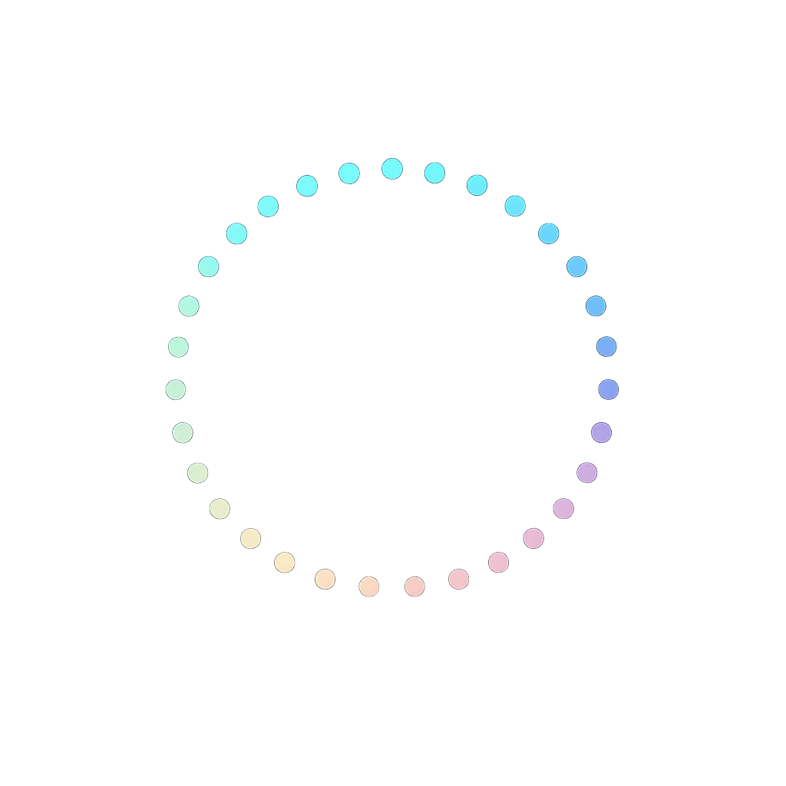

<p align="center">
  
</p>

<h1 align="center">CLAS</h1>

A native macOS menu-bar app that shows you which Claude Code sessions need your attention, and gets you back to them in one keystroke.

> If you run more than one `claude` at a time across terminal tabs, you've probably caught yourself glancing at the wrong window for a few seconds before realising the prompt was waiting on you somewhere else. CLAS exists for that.

<p align="center">
  
  <br>
  <em>HUD overlay (⌥Space)</em>
</p>

<br>
<br>

<p align="center">
  
  <br>
  <em>Menu bar popover</em>
</p>


## What it does

- **Menu bar indicator.** A solid orange `●` with a count when one or more sessions need you. Hollow `○` otherwise.
- **Floating HUD.** Hit a global hotkey (default ⌥Space) to see every active Claude session — sorted with the ones that need you on top — and press ↩ to jump straight to that terminal tab.
- **Native banners.** When a session transitions to "needs your attention", you get a system notification with the session's name, working directory, and what it's waiting on.
- **Click to address.** Click any row (in the popover or the HUD) and CLAS focuses that exact Ghostty tab and silently dismisses it from the count. The dismissal expires automatically the next time Claude does something new in that session.

## How it knows

CLAS reads two things:

1. **`~/.claude/sessions/*.json`** — Claude Code itself writes one JSON per running session with `status`, `cwd`, `name`, and (when relevant) what it's waiting on. CLAS polls this directory every 500 ms.
2. **A `Notification` hook** (optional but recommended) — a tiny shell script POSTs to a localhost HTTP listener inside the app whenever Claude needs you, so the UI updates within a few ms instead of waiting for the next poll.

That's the whole data pipeline. No private APIs, no scraping, no agents-running-agents.

## Requirements

- macOS 14 (Sonoma) or later
- [Ghostty](https://ghostty.org) — for click-to-focus. Other terminals are not yet supported (PRs welcome).
- A working `claude` CLI (Claude Code).
- Xcode 15+ / Swift 6 toolchain to build from source.

## Install

### Pre-built `.app` (recommended)

1. Download the latest `CLAS-*.zip` from [Releases](https://github.com/akashpatl/clas/releases).
2. Unzip and drag **CLAS.app** into `/Applications/`.
3. **First launch:** right-click the app → **Open** → click *Open* again. CLAS isn't notarised yet, so macOS Gatekeeper requires this once. Subsequent launches are normal.
4. You'll see a hollow circle in the menu bar — that's CLAS, watching for sessions that need you.

### Build from source (developers)

```bash
git clone https://github.com/akashpatl/clas.git
cd clas
./scripts/bundle.sh        # produces dist/CLAS.app
open dist/CLAS.app
```

Or for the bare SPM binary without bundling:

```bash
swift build -c release
.build/release/CLAS &
```

### Wire up the instant-notification hook (recommended)

Add the Notification hook to `~/.claude/settings.json` (preserve any existing entries):

```json
{
  "hooks": {
    "Notification": [
      {
        "matcher": "",
        "hooks": [
          {
            "type": "command",
            "command": "/absolute/path/to/clas/hooks/notify-sidebar.sh"
          }
        ]
      }
    ]
  }
}
```

Replace `/absolute/path/to/clas` with wherever you cloned the repo. The script always exits 0, so if CLAS isn't running it's a silent no-op.

Without the hook, CLAS still works — the filesystem polling catches everything within 500 ms.

## Usage

**Menu bar icon**
- Hollow circle: no sessions need you
- Solid orange circle + number: that many sessions are waiting on you

**Click the menu bar icon** for the popover: full session list, the global hotkey recorder, and Quit.

**Press ⌥Space** (rebindable in the popover) for the HUD overlay:
- `↑` / `↓` — move selection
- `↩` — focus the selected session's Ghostty tab
- `⎋` — dismiss the HUD without selecting

**Click any row** (popover or HUD) to focus that session's Ghostty tab and dismiss it from the count.

## How "needs your attention" is decided

A session counts toward the indicator when **either** of these is true:

1. Claude reports `status: waiting` (formal permission prompt or `AskUserQuestion`)
2. Claude's most recent visible message was an assistant message AND the session is otherwise idle (claude finished talking, isn't working — ball in your court)

Once you address a session (click its row), it's silently dismissed from the count. The dismissal expires automatically the next time `updatedAt` advances — i.e. the next time Claude does anything new — so a session always re-arms itself if there's something new to look at.

The predicate lives in `Sources/CLAS/Model/AttentionTracker.swift` and is intentionally compact (~5 lines) so you can refine it to your taste.

## Project layout

```
Sources/CLAS/
├── CLASApp.swift                # @main, AppDelegate, scene wiring
├── Model/                       # Pure data + state
│   ├── Session.swift            # Mirror of ~/.claude/sessions/*.json
│   ├── SessionStore.swift       # @Observable store + diff event types
│   └── AttentionTracker.swift   # "Ball in your court" predicate + dismissals
├── Services/                    # I/O against the outside world
│   ├── SessionsDirWatcher.swift # 500ms poll of ~/.claude/sessions/
│   ├── TranscriptReader.swift   # Tail-read JSONL for last visible message
│   └── HookHTTPListener.swift   # 127.0.0.1 listener for the hook ping
├── UI/                          # All SwiftUI / NSPanel surfaces
│   ├── MenuBarLabel.swift       # The status item icon
│   ├── MenuBarView.swift        # Popover content
│   ├── HUDPanel.swift           # NSPanel hosting the HUD
│   ├── HUDView.swift            # HUD SwiftUI body + keyboard nav
│   ├── HUDController.swift      # Show/hide + positioning
│   └── HotkeyName.swift         # KeyboardShortcuts identifier + default
├── Terminal/
│   ├── AppleScriptString.swift  # Safe AppleScript string escaping
│   └── GhosttyFocuser.swift     # Brings the right Ghostty tab to front
└── Notifications/
    └── Notifier.swift           # System banner via osascript
```

## Status

Pre-1.0. Works on the author's machine; expect rough edges.

> ⚠️ **CLAS depends on the *undocumented* schema of `~/.claude/sessions/{pid}.json`.** If a future Claude Code release changes how `status`, `waitingFor`, `updatedAt`, or the directory layout are written, CLAS will silently degrade (sessions appearing as "idle" or vanishing from the list) until the model is updated. Decoding is defensive — missing fields don't crash — but the relationship is fragile by design and worth knowing about before relying on it.

Other known gaps:

- Only Ghostty is wired up for click-to-focus. iTerm2 / Terminal.app / Warp are not yet supported.
- Notifications come from `osascript` rather than `UNUserNotificationCenter`, so banners don't deep-link back to CLAS when clicked.
- Not Apple-notarised; first launch requires the right-click → Open Gatekeeper bypass.
- No autostart-at-login wiring.

## Contributing

Issues and PRs welcome. When filing a bug please include macOS version, Claude Code CLI version (`claude --version`), Ghostty version, and a paste of `/usr/bin/log show --predicate 'subsystem == "CLAS"' --last 5m --info` if relevant — the issue template will prompt you for these.

## License

MIT — see [LICENSE](LICENSE).
